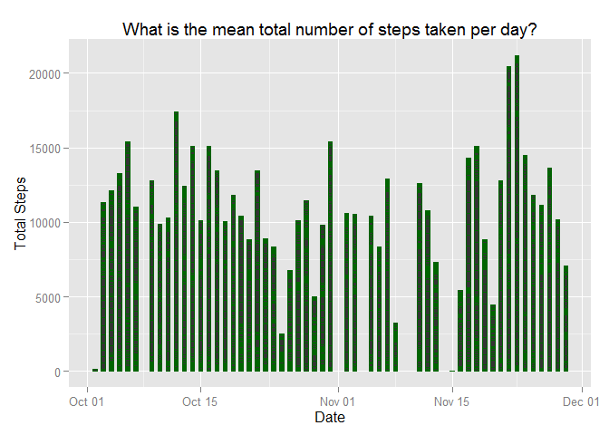

# Reproducible Research: Peer Assessment 1

```r
## setup stuff
echo=TRUE
setwd("C:/Users/Matthew/Documents/Coursera/Reproduceable Research")

## Loading and preprocessing the data
activity_raw <- read.csv("activity.csv")
#str(activity_raw)
activity_clean <- read.csv("activity.csv", colClasses = c("integer","Date","factor"))
#str(activity_clean)

### What is mean total number of steps taken per day?

#### Make a histogram of the total number of steps taken each day


library(ggplot2)
ggplot(activity_clean, aes(date,steps)) + geom_bar(stat="identity", width=0.5, color="darkgreen") + labs( title= "What is the mean total number of steps taken per day?", x="Date", y="Total Steps")
```

```
## Warning in loop_apply(n, do.ply): Removed 2304 rows containing missing
## values (position_stack).
```

 

```r
#### Calculate and report the mean and median total number of steps taken per day
library(doBy)
```

```
## Loading required package: survival
```

```r
sumbyday <- summaryBy(steps ~ date, data = activity_clean, 
   FUN = function(x) { c(m = round(sum(x))) } )
#str(sumbyday)
mean(sumbyday$steps,na.rm=TRUE)
```

```
## [1] 10766.19
```

```r
median(sumbyday$steps,na.rm=TRUE)
```

```
## [1] 10765
```

```r
### What is the average daily activity pattern?

#### Make a time series plot (i.e. type = "l") of the 5-minute interval (x-axis) and the average number of steps taken, averaged across all days (y-axis)

meanStepsBYint <- aggregate(steps ~ interval, data = activity_raw, FUN = mean)
library(plyr)
meanStepsBYint <- rename(meanStepsBYint, c("steps"="steps.mean"))
#str(meanStepsBYint)

plot(meanStepsBYint, type="l",xlab="5-minute interval", ylab="average steps")
```

 

```r
### Which 5-minute interval, on average across all the days in the dataset, contains the maximum number of steps?
meanStepsBYint[meanStepsBYint$steps.mean == max(meanStepsBYint$steps.mean), ]
```

```
##     interval steps.mean
## 104      835   206.1698
```

```r
### Imputing missing values

## 1 Calculate and report the total number of missing values in the dataset (i.e. the total number of rows with NAs)
sum(is.na(activity_raw))
```

```
## [1] 2304
```

```r
##2 Devise a strategy for filling in all of the missing values in the dataset. The strategy does not need to be sophisticated. For example, you could use the mean/median for that day, or the mean for that 5-minute interval, etc.
### let's just take the mean by interval created in the last section and merge it with the original data

## 3 Create a new dataset that is equal to the original dataset but with the missing data filled in.

library(dplyr)
```

```
## 
## Attaching package: 'dplyr'
## 
## The following objects are masked from 'package:plyr':
## 
##     arrange, count, desc, failwith, id, mutate, rename, summarise,
##     summarize
## 
## The following object is masked from 'package:stats':
## 
##     filter
## 
## The following objects are masked from 'package:base':
## 
##     intersect, setdiff, setequal, union
```

```r
activity.miss.clean <- merge(activity_raw,meanStepsBYint,by="interval")
activity.miss.clean <- mutate(activity.miss.clean, steps.clean = ifelse(is.na(steps),steps.mean,steps))

## 4 Make a histogram of the total number of steps taken each day and Calculate and report the mean and median total number of steps taken per day. 

ggplot(activity.miss.clean, aes(date,steps.clean)) + geom_bar(stat="identity", width=0.5, color="darkgreen") + labs( title= "What is the mean total number of steps taken per day? MISS CLEANED", x="Date", y="Total Steps")
```

 

```r
## Do these values differ from the estimates from the first part of the assignment? What is the impact of imputing missing data on the estimates of the total daily number of steps?
### let's look at the meand and median before and after missing inputing

mean(sumbyday$steps,na.rm=TRUE) # dataset created before
```

```
## [1] 10766.19
```

```r
median(sumbyday$steps,na.rm=TRUE) # dataset created before
```

```
## [1] 10765
```

```r
### recreate for the cleaned data
sumbyday.clean <- summaryBy(steps ~ date, data = activity.miss.clean, 
   FUN = function(x) { c(m = round(sum(x))) } )
#str(sumbyday.clean)
mean(sumbyday.clean$steps,na.rm=TRUE)
```

```
## [1] 10766.19
```

```r
median(sumbyday.clean$steps,na.rm=TRUE)
```

```
## [1] 10765
```

```r
### I do not see much measureable difference after imputting for missing values

## Are there differences in activity patterns between weekdays and weekends?

### Create a new factor variable in the dataset with two levels -- "weekday" and "weekend" indicating whether a given date is a weekday or weekend day.
activity.miss.clean <- mutate(activity.miss.clean, weekday.weekend = factor(ifelse(weekdays(as.Date(date)) %in% c("Saturday", "Sunday"),"Weekend","Weekday")))

### Make a panel plot containing a time series plot (i.e. type = "l") of the 5-minute interval (x-axis) and the average number of steps taken, averaged across all weekday days or weekend days (y-axis).

par(mfrow = c(2, 1),mar = rep(2, 4))
for (x in c("Weekend", "Weekday")) {
    forplot.x <- aggregate(steps.clean ~ interval, data = activity.miss.clean,
    subset = activity.miss.clean$weekday.weekend == 
        x, FUN = mean)
    plot(forplot.x, type = "l", main = x, xlab="Interval", ylab="Steps")
}
```

 
